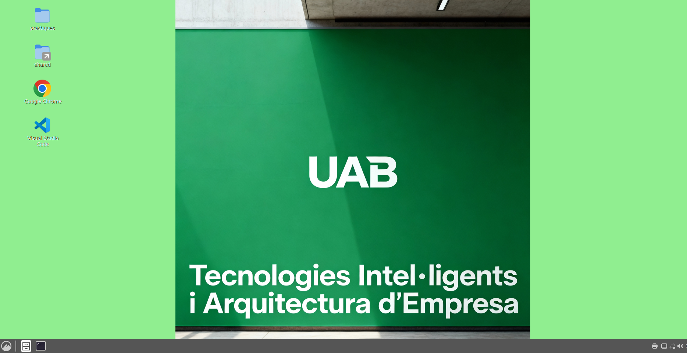

# UAB VM - Màquina Virtual per Pràctiques

Aquest projecte proporciona una màquina virtual Ubuntu 24.04 LTS preconfigurada amb tot el programari necessari per a les pràctiques de classe.

## 🎯 Què fa aquest projecte?

El fitxer `Vagrantfile` configura automàticament:
- ✅ Una màquina virtual Ubuntu amb escriptori gràfic Cinnamon
- ✅ Autologin automàtic (no cal posar contrasenya). 
- ✅ Eines de desenvolupament: Python, Node.js (via NVM), n8n, Puppeteer (deps), Git, etc.
- ✅ Google Chrome i Visual Studio Code amb accessos directes a l’escriptori
- ✅ Les pràctiques de classe a l’escriptori
- ✅ Una carpeta compartida entre el teu ordinador i la VM (`~/shared`) i enllaç a l’Escriptori


## 🖼️ Captura de pantalla



**No cal configurar res manualment!** Només has d'executar una comanda i esperar.

## 📋 Requisits previs

Necessites instal·lar aquests dos programes al teu ordinador (Windows, Mac o Linux):

### 1. VirtualBox
Descarrega i instal·la des de: https://www.virtualbox.org/wiki/Downloads

### 2. Vagrant
Descarrega i instal·la des de: https://developer.hashicorp.com/vagrant/downloads

**Verifica que estan instal·lats:**
Obre un terminal (o PowerShell a Windows) i executa:
```bash
vagrant --version
VBoxManage --version
```

Si veus els números de versió, tot està correcte! ✅

## 🚀 Com posar en marxa la VM

### Pas 1: Descarrega aquest projecte

Obre un terminal i executa:

```bash
git clone https://github.com/davidayalas/uab_vm.git
cd uab_vm
```

O descarrega el ZIP des de GitHub i descomprimeix-lo.

### Pas 2: Arrenca la màquina virtual

Dins del directori `uab_vm`, executa:

```bash
vagrant up
```

**⏳ Tingues paciència!** La primera vegada trigarà entre 15-30 minuts perquè:
1. Descarrega la imatge base d'Ubuntu
2. Instal·la tot el programari necessari
3. Configura l'entorn (escriptori, idioma, Chrome, VS Code, etc.)

En acabar, s’obrirà una finestra amb l’escriptori de la màquina virtual.

👉 Recomanat després del primer arrenc: executa
```bash
vagrant reload
```
per assegurar que totes les configuracions gràfiques s’apliquen correctament.

### Pas 3: Ja està! 🎉

La VM està llesta per utilitzar:
- **Usuari**: "vagrant" (autologin automàtic, no cal contrasenya). Password "vagrant", si ho necessitessis.
- **Escriptori**: Cinnamon
- **Pràctiques**: Les trobaràs a l'escriptori en la carpeta `practiques`
- **Carpeta compartida**: `~/shared` (també tens un enllaç a l’Escriptori)

## 🔧 Comandes útils

```bash
# Aturar la VM (com apagar l'ordinador)
vagrant halt

# Tornar a arrencar la VM
vagrant up

# Reiniciar la VM
vagrant reload

# Eliminar completament la VM (si vols tornar a començar de zero)
vagrant destroy

# Accedir per terminal SSH (sense interfície gràfica)
vagrant ssh
```

**Important**: Executa aquestes comandes des del directori `uab_vm/` (on està el Vagrantfile).

## ⚙️ Modificar els recursos de la VM

Si la teva màquina té poca memòria RAM o vols donar més recursos a la VM, edita el fitxer `Vagrantfile`:

```ruby
config.vm.provider "virtualbox" do |vb|
  vb.memory = "4096"  # Memòria RAM en MB (4096 = 4 GB)
  vb.cpus = 2         # Número de CPUs
end
```

**Recomanacions:**
- **RAM mínima**: 2048 MB (2 GB)
- **RAM recomanada**: 4096 MB (4 GB)
- **CPUs**: La meitat dels processadors del teu ordinador

Nota: Al macOS es desactiva l’acceleració 3D automàticament per compatibilitat; a altres sistemes s’activa.

Després de modificar, reinicia la VM:
```bash
vagrant reload
```

## 📦 Programari inclòs

La VM ja té instal·lat:
- **Python 3** (amb pip i venv)
- **Node.js LTS** via **NVM** + paquets globals: `n8n`, `localtunnel`
- **Puppeteer (dependències del sistema)** per a web scraping
- **Google Chrome** (pàgina d’inici i marcador a http://localhost:5678)
- **Visual Studio Code**
- **VirtualBox Guest Additions** (portapapers i arrossegar-i-deixar)
- **Git, curl, wget**

## 📁 On són les meves pràctiques?

Dins la VM:
- 📂 `~/Desktop/practiques` - Les pràctiques de classe (es descarreguen automàticament)
- 📂 `~/shared` - Carpeta compartida amb el teu ordinador (sincronitzada amb `uab_vm/shared/`)
- 🔗 Enllaç `shared` a l’Escriptori per accés ràpid

## 🚀 Iniciar n8n

```bash
cd ~/Desktop/practiques/n8n
./n8n-start.sh
```

Un cop n8n s’estigui executant, obre http://localhost:5678 (Chrome ja té aquesta adreça com a pàgina d’inici i marcador). També aixeca un túnel públic per a que Telegram o altres serveis puguin invocar els teus nodes que llencen processos.

## 🐛 Problemes comuns

### La VM no arrenca o va molt lenta
- Verifica que tens virtualització habilitada a la BIOS
- Augmenta la RAM assignada a la VM (edita el Vagrantfile)
- Tanca altres programes pesats mentre utilitzes la VM

### Error "No usable sandbox" amb Puppeteer
Els scripts de Puppeteer necessiten aquestes opcions:

```javascript
const browser = await puppeteer.launch({
  headless: true,
  args: [
    '--no-sandbox',
    '--disable-setuid-sandbox',
    '--disable-dev-shm-usage'
  ]
});
```

### Vull actualitzar les pràctiques
Des de dins la VM, obre un terminal i executa:

```bash
cd ~/Desktop/practiques
git pull
```

### Vull començar de zero
Si vols esborrar-ho tot i tornar a començar:

```bash
vagrant destroy -f
vagrant up
```

Això esborrarà la VM completament i la tornarà a crear des de zero.

## 💡 Consells

- **Fes snapshots**: Des de VirtualBox pots fer captures de l'estat de la VM per tornar enrere si alguna cosa va malament
- **Carpeta compartida**: Utilitza `uab_vm/shared/` per passar fitxers entre el teu ordinador i la VM
- **Apaga correctament**: Sempre utilitza `vagrant halt` abans de tancar el terminal o apagar l'ordinador

## 📞 Necessites ajuda?

Si tens problemes:
1. Revisa aquesta documentació
2. Comprova que tens l'última versió de VirtualBox i Vagrant

---
